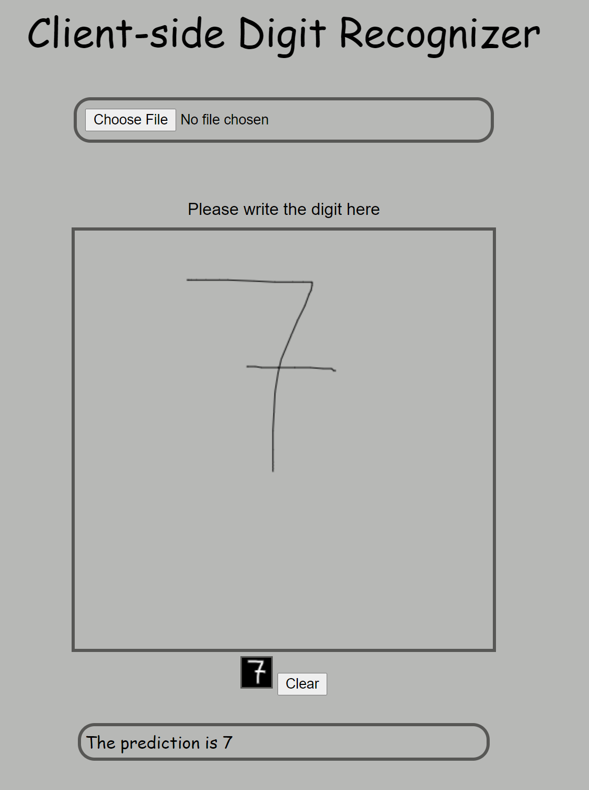
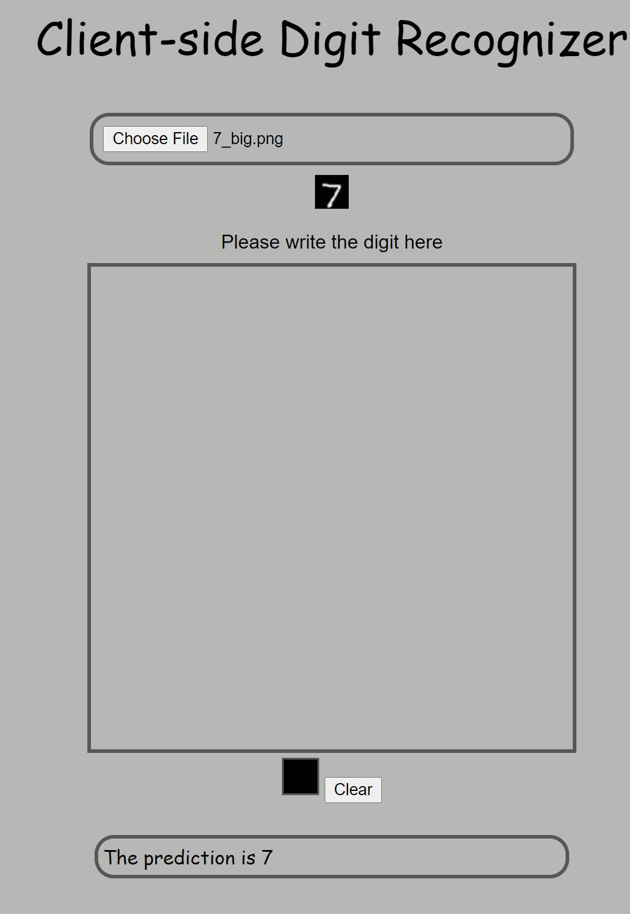

# Digit Recognizer Web Demo 

This is my client-side MNIST prediction. I have trained my model in Python and saved the model weight and allowed my model to do the prediction in Javascript. Client has different choice to provide image, they can either draw on the Canvas I created or upload an image file. With both option, I have handled the resize part and the preprocessing so that no matter what input clients provide, it will always be transformed into a similar to MNIST feature that my model has been trained on, in order to achieve the accuracy of 99.7%. 

